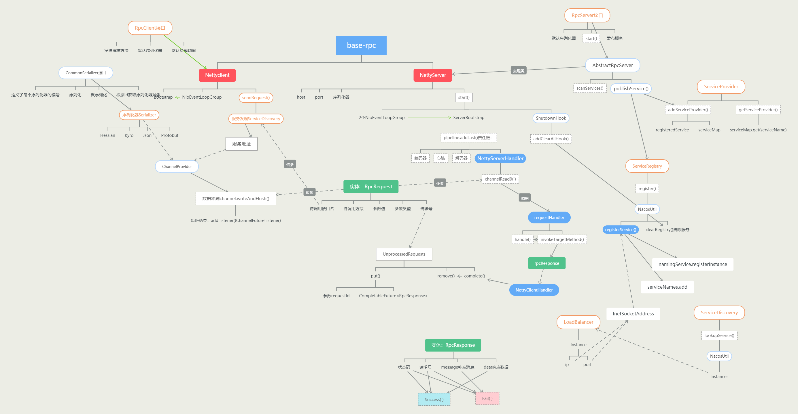

# base-RPC
rpc框架实现
## 架构

高清图在线查看：http://assets.processon.com/chart_image/60faf4e4e0b34d49622e330e.png
## 模块
- rpc-api：提供通用接口
- rpc-common：提供实体、枚举、异常、等通用工具类
- rpc-core：核心实现
- test-client：测试用客户端
- test-server：测试用服务端
## 重点
负载均衡、服务自动注册与发现、服务自动注销、四种序列化方式、Netty及定义传输协议
## 启动
本地导入项目后，先启动nacos：
```shell
startup.cmd -m standalone
```
再启动NettyTestServer，再启动NettyTestClient
在启动类上需要有ServiceScan注解，在服务实现类上需要有Service注解。
## LICENSE
MIT